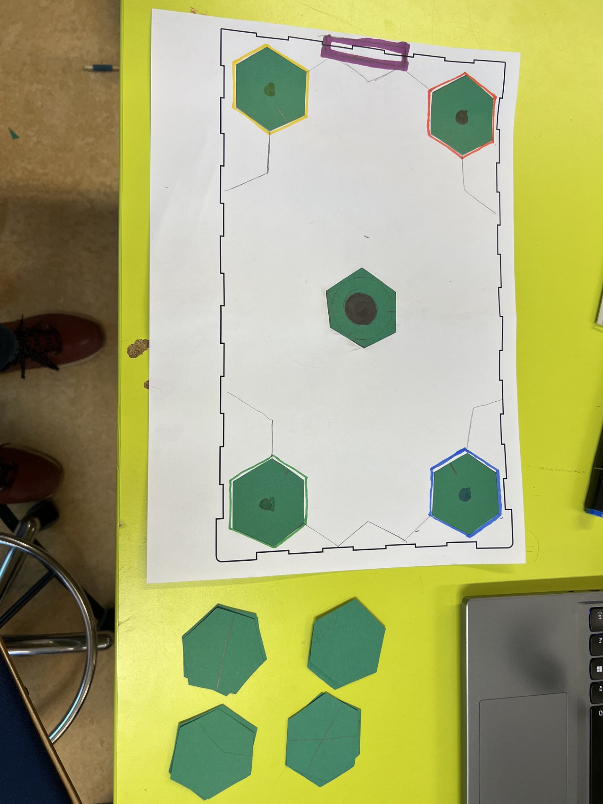
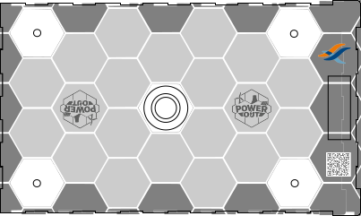

# Power Out
### Höfundar
Emil, Logi & Þröstur

### Stutt lýsing á hugmynd
Spilið byggir á strategíu, rafmamgnsþekkingu og samvinnu. Það gengur út á það að leikmenn reyna að tengja borgir aftur við rafmagn þegar þær detta út með því að tengja saman snúrur. Markmiðið er að tengja allar borgirnar aftur við rafmagn en ef leikmenn ná því ekki tapa þeir.

### Leikjaspilun ([Útprentað](./spilareglur.pdf))
Spilið inniheldur 5 borgir og af þeim eru 4 fyrir leikmenn. Leikmenn ýta á takkann í miðjunni til þess að komast að því hvaða lit af reit þeir mega taka næst en í hver tvö skipti sem ýtt er á takkann dettur rafmagnið út í einni handahófskenndri borg (ljósið í henni slokknar). Leikmenn geta notað einn reit af þeim lit sem var birtur á skjáinn til þess að reyna að ná aftur í rafmagn. Þetta heldur áfram þar til allar borgir hafa reynt að slökkva einu sinni á sér, og ef leikmenn hafa ekki tengt a.m.k. eina borg við aðalborgina þá tapa þeir. Eftir þetta reyna leikmenn að ná að tengja hinar borgirnar í aðalborgina (í miðjunni) til þess að ná aftur rafmagni í allar borgirnar. Ef rafmagn kemst á allar borgir vinna leikmenn en ef þeir ná því ekki (t.d. ef borðið flækist og réttir reitir komast ekki fyrir) þá tapa þeir.

### Spilareglur ([Útprentað](./spilareglur.pdf))
- Leikmenn eiga að vinna saman.
- Hver og einn leikmaður getur gert einu sinni í einu. Leikmaður ýtir á takkann í miðjunni og notar reit af þeim liti.
- Ef slokknar á öllum borgum án þess að leikmenn nái að tengja eina við rafmagn tapa þeir. Sömuleiðis ef þeir geta ekki lengur tengt einhverja borg.
- Ef leikmenn ná að kveikja aftur á öllum borgum vinna þeir.
- Reitir eru fastir á borði en þó má taka þá upp til þess að lagfæra (ljós slokknar ekki ef hún hefur áður verið tengd í aðalborgina).

### Mynd af pappírsfrumgerð
Á borðinu sjást sexhyrningar. Þeir tákna borgirnar sem eru í spilinu. Sexhyrningarnir sem eru við hliðina á borðinu eru hins vegar reitirnir sem spilarar munu setja niður til þess að tengja saman snúrur. Á hverri borg (fyrir utan miðju-borgina) er svo búið að koma fyrir ljósi í ákveðnum liti, en það eru LED ljósin sem kvikna og slokkna meðan spilað er. Í miðju-borginni er hins vegar stór takki og utan um hann er 16-pera NeoPixel hringur. Á enda spilsins, vinstra megin, má svo sjá fjólubláa útlínu sem táknar LCD skjáinn. Að lokum eru línurnar sem teiknaðar hafa verið á borðið endar spilsins og litirnir kringum sexhyrningana litirnir sem þeir verða prentaðir í.

### Mynd af pappírsfrumgerð

### SVG af borðspili

### STL af 3D leikmunum
[STL af borðspili](../myndir/Untitled1.stl)

### Mynd inni í spili

#
